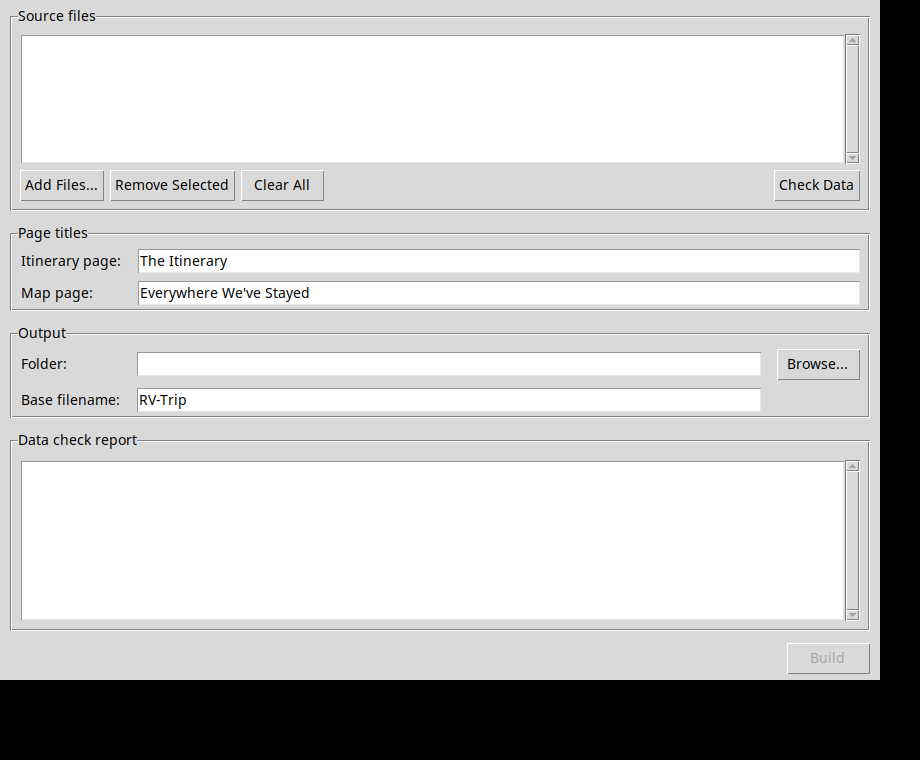
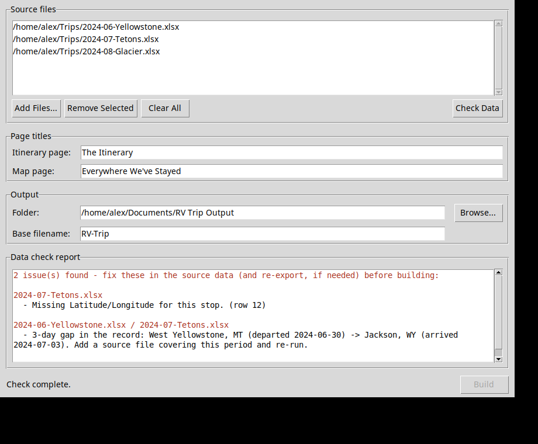

# User guide

This covers the desktop app: installing it, running it, and what to do when
the data check finds a problem. For the design rationale behind *why* the
tool behaves this way, see [`HISTORY.md`](HISTORY.md). For the required
source-file columns, see the main [`README.md`](../README.md).

## Installing

Download the installer for your system - no account or command line needed:

- **[Windows](https://github.com/regregoryallen/RV-Trip-Visualizer/releases/latest/download/RVTripVisualizer-Setup.exe)** -
  run the installer, then launch "RV Trip Visualizer" from the Start Menu.
- **[Linux (AppImage)](https://github.com/regregoryallen/RV-Trip-Visualizer/releases/latest/download/RVTripVisualizer-x86_64.AppImage)** -
  `chmod +x` it, then run it directly. No installation step.

## The main window

- **Source files** - the export files you're building from. Nothing here is
  modified; the app only ever reads these.
- **Page titles** - what appears as the `<title>` and heading on each
  generated web page.
- **Output** - where the generated files get written, and the shared prefix
  for their names.
- **Data check report** - results of the last check, and where build
  problems get explained.

All of these (file list, titles, output location) are remembered between
runs, so you don't have to re-pick them every time you add a new trip.

## Workflow

1. **Add Files...** - select one or more export files. Multi-select is
   supported; add as many trips as you want in the final output.
2. **Check Data** - reads every selected file and reports anything wrong.
   Nothing is written to disk yet.
3. If the report lists issues, fix them **at the source** (see below), then
   click **Check Data** again. There's no way to patch around a problem from
   inside this app - that's deliberate, not a missing feature.
4. Once the report says *"All N file(s) passed. Ready to build."*, set your
   page titles and output folder/filename, and click **Build**.
5. Build writes four files to your chosen folder (see **Output files**
   below).

Changing the file selection (adding, removing, or clearing files) always
requires a fresh **Check Data** before **Build** becomes available again -
the app never builds from a stale check.

## Reading the data check report

Every finding names the file (and row, if it's row-specific) and says what's
wrong in plain language. The common ones:

| Finding | What it means | How to fix it |
|---|---|---|
| Missing required column(s) | The file's header row is missing one of the columns this tool needs (see `README.md`) | Add the column in your planning tool and re-export |
| Nights value is not a number | A row's Nights cell has text or is malformed | Fix that cell in the source tool and re-export |
| No Arrival Date, and none could be inferred | A row has no date, and there's no usable "Start Date" label earlier in the file to infer it from | Fill in the Arrival Date for that row and re-export |
| Missing Latitude/Longitude | A stop has no coordinates | Most planning tools geocode this automatically when you pick a real place for the stop - check the venue is set correctly |
| Could not determine a state for this stop | Neither the Location/Stop Name text nor the coordinates resolve to a US state (or Canadian province / Mexican state) this tool recognizes | Add recognizable location text (e.g. "City, ST") to the Location field, or confirm the coordinates are correct |
| *N*-day gap in the record | Nothing in your selected files covers this stretch of time | Add a source file (an export, or a hand-made one in the same format) covering that period |

A finding under **Notes** (not a red "issue") isn't blocking - it's
informational, such as a mileage rescue during overlap resolution, or a
small rounding difference between a file's own Miles and Total columns.
Build still works normally.

### Why isn't there a "fix it for me" button?

Early versions of this project had exactly that, and it caused real
problems: encoding one person's memory of their own trip gaps directly into
the tool's logic made it impossible for anyone else to use. Every finding
here always traces back to something you can go change in the source
data - if a check doesn't meet that bar, it doesn't exist. See
[`HISTORY.md`](HISTORY.md#why-theres-no-mechanism-for-correcting-data-in-tool)
for the full reasoning.

## Output files

Given a base filename `RV-Trip`, **Build** writes:

| File | What it is |
|---|---|
| `RV-Trip-data.json` | The merged, canonical stay list - every other output is derived from this |
| `RV-Trip.xlsx` | A spreadsheet version, one row per stay |
| `RV-Trip-Itinerary.html` | A standalone itemized web page, grouped by year |
| `RV-Trip-Map.html` | An interactive map, color-coded by year, with a timeline scrubber |

All four are self-contained - no server, database, or internet connection
needed to open and use them (the map's real tile basemap does need internet
access to load; see its own Help for details, and it falls back to an
offline outline map automatically if tiles can't load).

## Troubleshooting

- **A file I added doesn't seem to be included.** Check it's actually in
  the Source files list (adding a file to disk doesn't add it to the app -
  use **Add Files...**), and that you clicked **Check Data** again after
  adding it. The report shown is always from the last Check Data run, not a
  live view.
- **Build is grayed out.** Either Check Data hasn't been run against the
  current file selection yet, or the last check found issues. Run **Check
  Data** and read the report.
- **The window is too small to see the Build button.** This shouldn't
  happen - the window has a minimum size that always keeps it visible. If it
  does happen, please report it (it's a bug).
